# 04 - Virtual Cloud Network (VCN)

## Tujuan Pembelajaran
1. Mengetahui layanan Oracle Cloud Infrastructure Networking
2. Mampu mengaktifkan port 80 melalui Virtual Cloud Network (VCN) di layanan Oracle Cloud
3. Mampu memasang Apache server dan mengonfigurasi IP tables Firewalls

## Hasil Praktikum :

### Praktikum 1

1. Login ke akun Oracle Cloud

    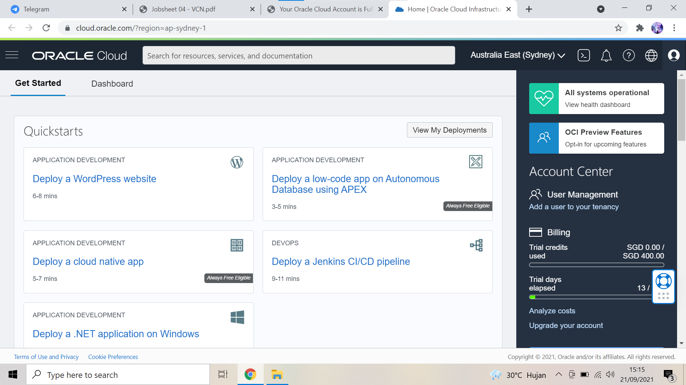

2. Setelah berhasil login dan ada di beranda Oracle Cloud akun, pilih menu Networking > Virtual Cloud Networks

    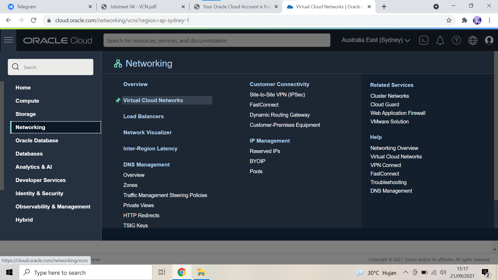

3. Pastikan VCN sudah ada, biasanya jika berhasil telah membuat VM dari modul pertemuan sebelumnya maka VCN akan tampil di sini. Silakan klik nama VCN tersebut.

    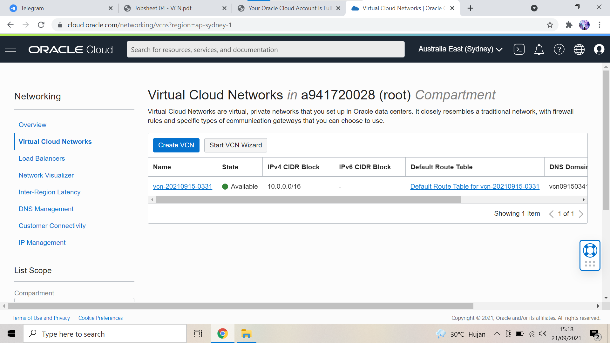

4. Pilih Security Lists di panel kiri (Resources) lalu pilih Default Security List di tabel yang tersedia

    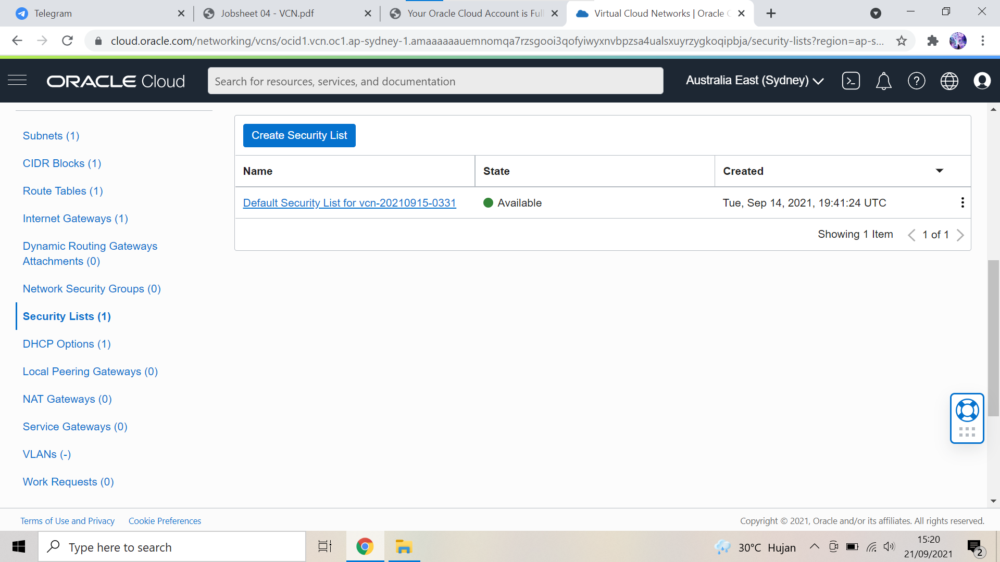

5. Mengisi **Ingress Rules** sesuai dengan nilai yang sudah ditentukan.

    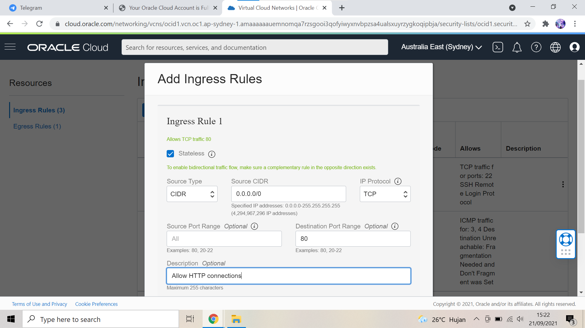

### Praktikum 2

1. Buka instance melalui menu Compute > Instances, kemudian copy IP public VM yang ingin kita akses untuk diatur web server Apache. 

2. Selanjutnya lakukan akses ke VM atau server

    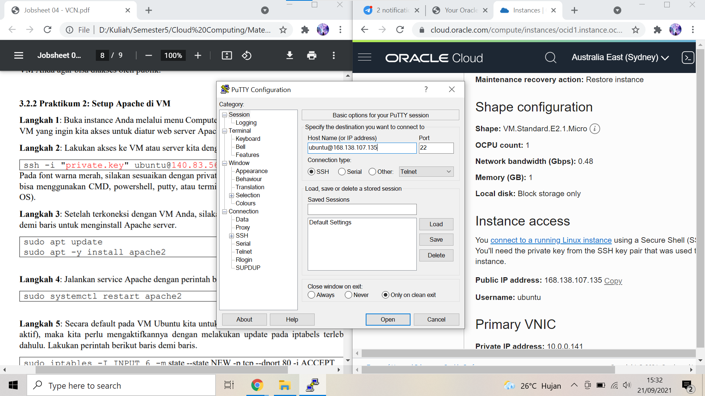
    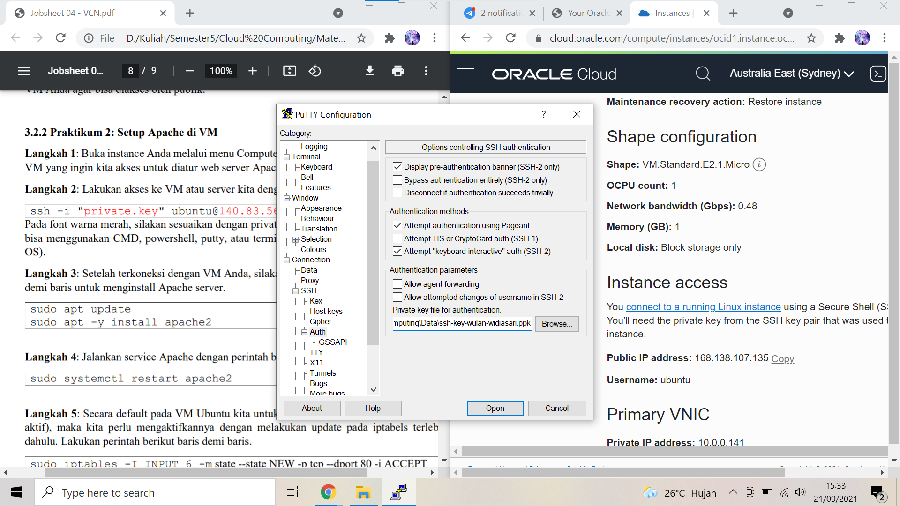

3.  Setelah terkoneksi dengan VM Anda, 

    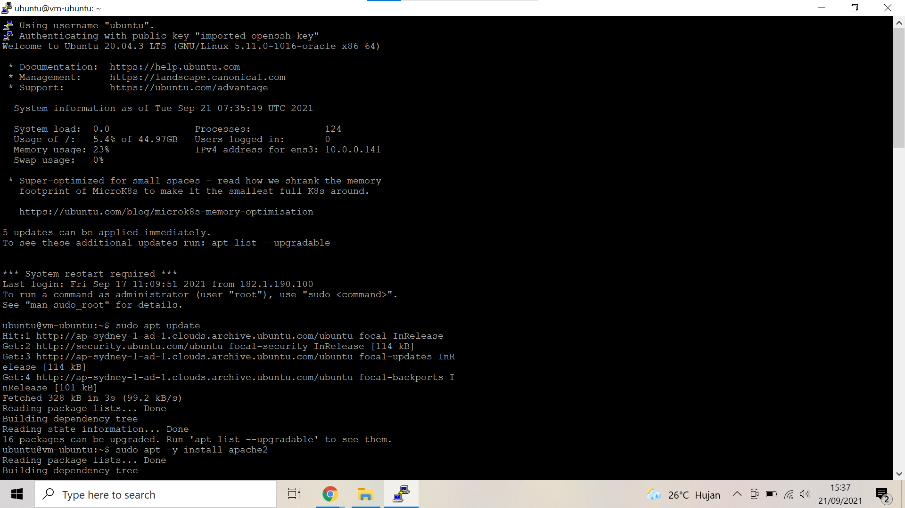
    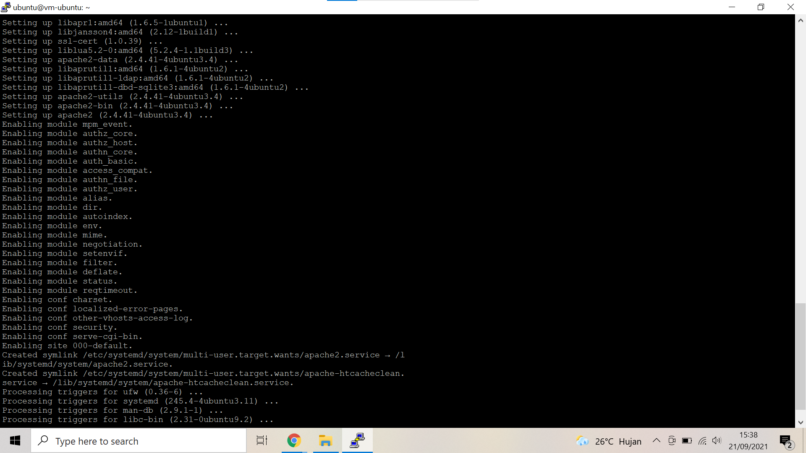

4. Setelah itu jalankan perintah **sudo systemctl restart apache2**

    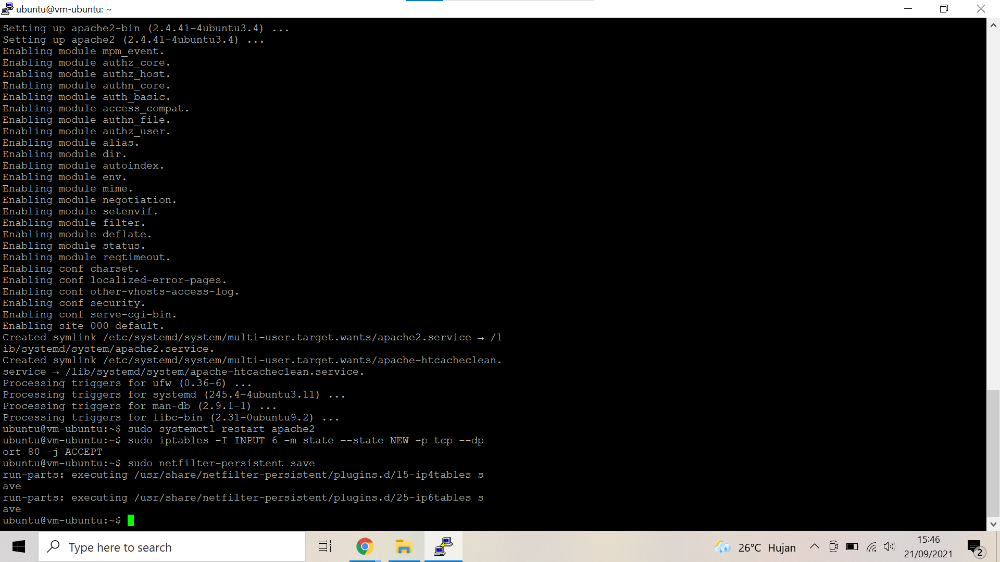

5. Setelah aktifkn VM pada ubuntu dengan menjalankan perintah di bawah ini.

    

6. Apabila telah berhasil maka ketikkan alamat IP public pada browser. Akan tampil tampilan seperti pada gambar dibawah 

    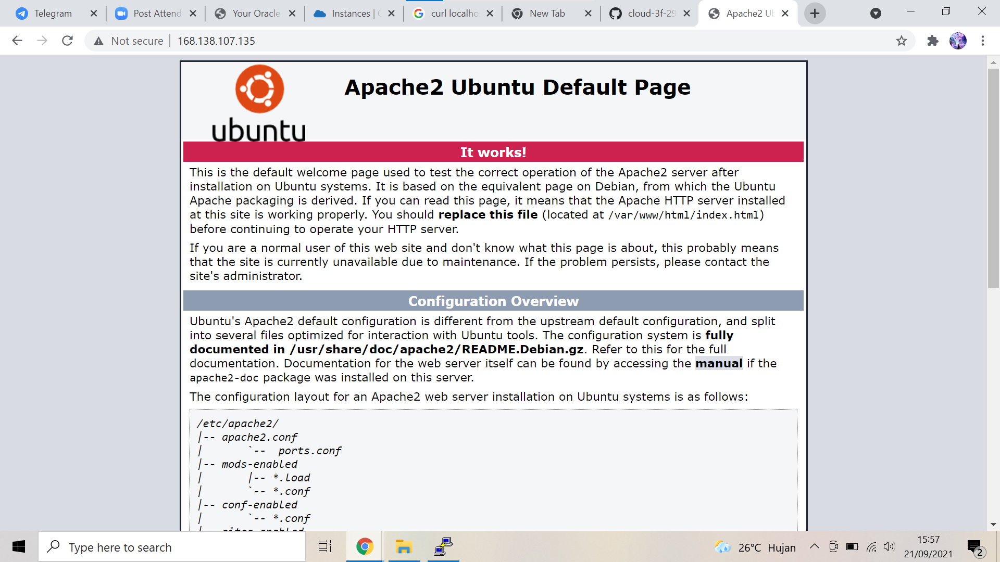

## TUGAS INSTALL PHP

1. Update source list Ubuntu

    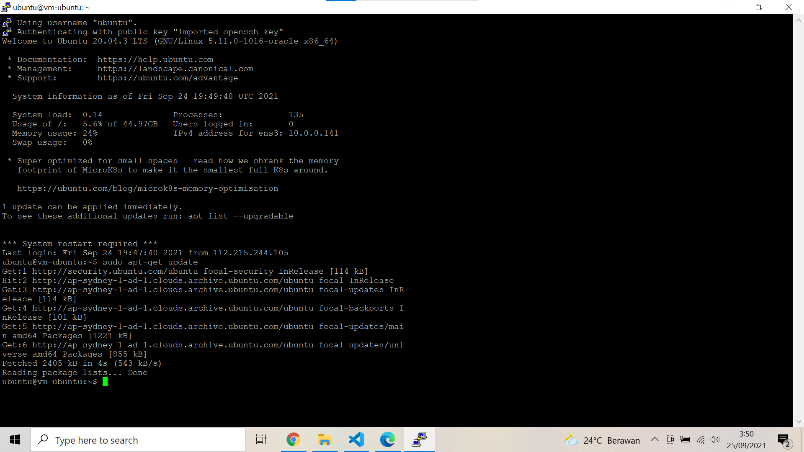

2. Tambahkan PPA Ondřej Surý’s

    Secara default versi PHP yang ada pada repository Ubuntu adalah versi 7.0, agar dapat menggunakan PHP versi 7.2 maka kita harus menambahkan repository PPA Ondřej Surý’s.

    Silakan install software-properties-common dan python-software-properties terlebih dahulu menggunakan perintah **sudo apt-get install software-properties-common python-software-properties**

    Jika sudah terinstall lanjut ke tahap berikutnya. Tambahkan PPA Ondřej Surý’s: **sudo add-apt-repository -y ppa:ondrej/php**

    Kemudian dilanjutkan dengan mengupdate source paket Ubuntu: **sudo apt-get update**

    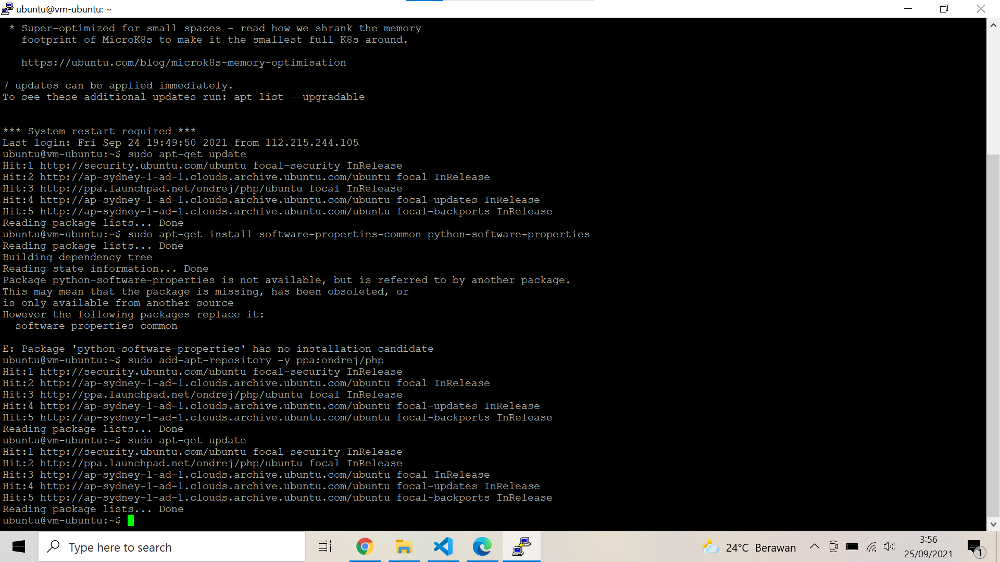

3. Install PHP 7.2

    Setelah berhasil menambahkan repository Ondřej Surý’s PPA, install PHP 7.2 dengan perintah: **sudo apt-get install php7.2**
    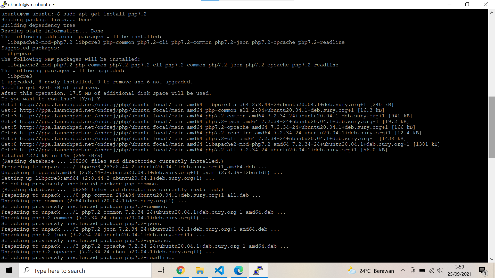
    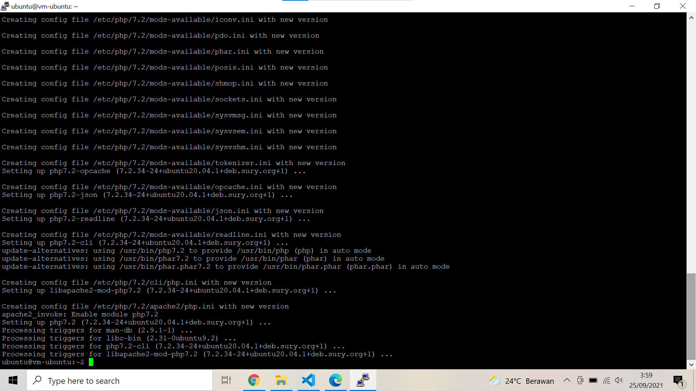

4. Install ekstensi PHP 7.2
    
    Agar PHP 7.2 dapat berjalan dengan baik, install ekstensi yang dibutuhkan.
    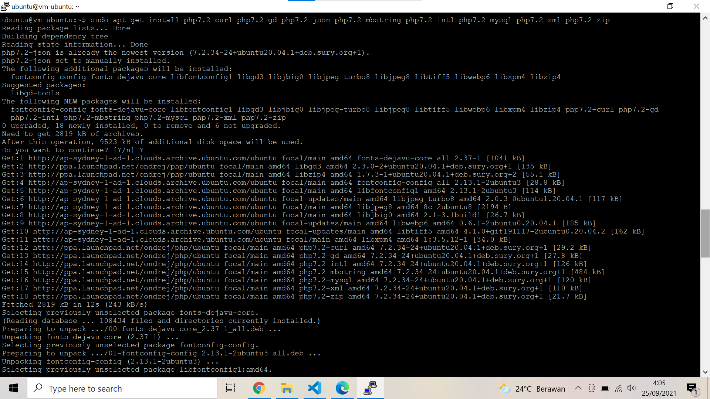
    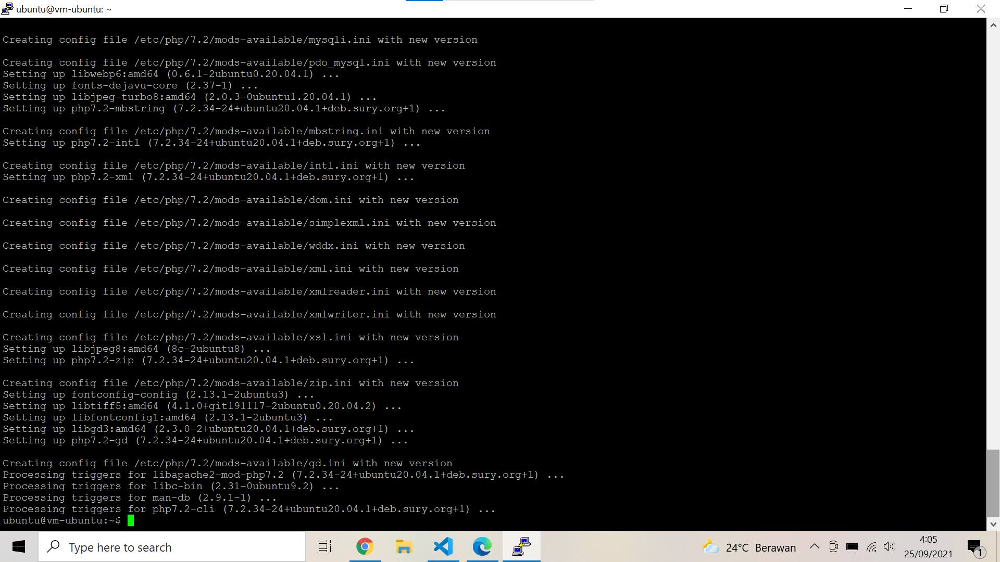

5. Cek PHP apakah sudah terinstal atau belum menggunakan **php -v**

    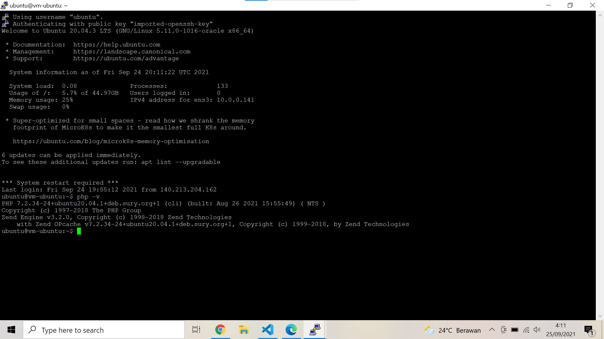
