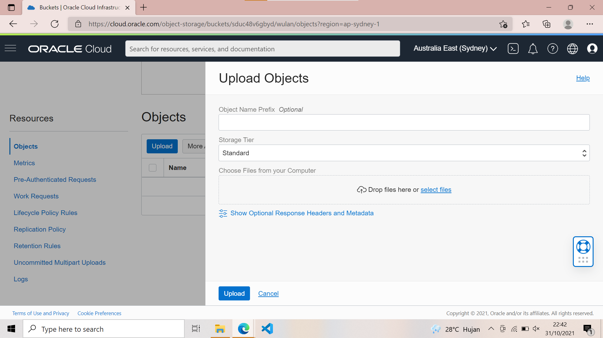

# 08 - Object Storage (OS)

## Tujuan Pembelajaran

1. Mengetahui Object Storage yang ditawarkan Oracle Cloud Infrastructure (OCI)
2. Dapat memanfaatkan layanan Object Storage yang ditawarkan Oracle Cloud Infrastructure (OCI)

# Hasil Praktikum

Berikut ini adalah dokumentasi praktikum 08 - Object Storage.

1. Membuat bucket untuk website. Sign-in ke OCI kemudian pilih Object Storage.
    

2. Create Bucket → Pilih standar bucket.
    

3. Beri nama bucket name, jika sudah klik create
    
    

4. Klik bucket yang telah di buat tadi.
    
    
    jika sudah lalu klik Edit visibility dan ubah visibility dari private ke public lalu klik save.

    

5. Jika sudah mengedit visibility, scroll down pada bagian bawah dan klik upload.

   
   
6. Upload semua file yang telah di beri di LMS:

    
    
    Jika file berhasil di upload akan berstatus finished lalu pada bagian object akan seperti tampilan dibawah ini:

    

7. Klik pada index.html maka akan tampil seperti di gambar bawah ini: 

    

8. Klik link (URL PATH) hingga akan tampil new window pada browser dengan output seperti di bawah ini :

    

9. Klik (click me) untuk mengubah background color

    
    
    
    
    
    
