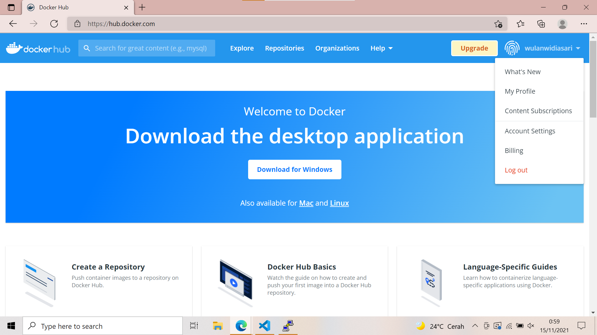

# 10 - Docker Bagian 01

## Tujuan Pembelajaran

1. Mengetahui perbedaan antara virtualisasi dengan container.
2. Mengetahui konsep docker dalam membangun sebuah aplikasi
3. Memanfaatkan container dalam membangun aplikasi
4. Mengetahui perintah dasar docker

## Hasil Praktikum

### Install Docker dan Membuat Kontainer
Berikut ini adalah hasil dari langkah-langkah praktikum :

1. Silakan masuk ke virtual mesin Anda kemudian jalankan perintah di bawah ini
    
    
    

    Tunggu beberapa saat sampai proses update selesai, jika ada dialog yang menginfokan untuk dilakukan upgrade silakan dijawab dengan ‘y’

2. Install paket yang dibutuhkan sebelum melakukan installasi docker, jalankan perintah di bawah ini :
    

3. Langkah selanjutnya yaitu menambahkan repository docker, dengan beberapa baris perintah di bawah ini :
    
    
    
    

    Jika kita lihat output dari perintah terakhir menandakan bahwa docker belum terinstall dan sudah ada di repository untuk siap dilakukan installasi.

4. Silakan lakukan installasi menggunakan perintah berikut ini :

    

    Ketika progress installasi sudah selesai, kemudian cek apakah docker daemon sudah jalan menggunakan perintah systemctl.

    

    Jika menampilkan status active (running), berarti docker daemon sudah berjalan. Untuk  jelasnya perhatikan output di bawah ini

5. Untuk memastikan kembali, kita butuh menggunakan image test apakah docker benar-benar berjalan sebagaimana semestinya. Gunakan perintah :

    

6. Jika kita perhatikan perintah-perintah di atas, untuk menjalankan docker harus menggunakan sudo, sedangkan terkadang semua pengguna memiliki image masing-masing. Untuk menjalankan perintah docker tanpa menggunakan sudo, berikut ini perintahnya :

    

7. Ketika kita mengembangkan aplikasi web tentunya membutuhkan sebuah web server, hal yang dilakukan dengan melakukan installasi paket tersebut diikuti dengan Langkah-langkah yang lain. Dengan docker, kita cukup satu baris perintah apache sudah bisa berjalan. 

    

### Membuat akun docker Hub

Berikut ini adalah hasil dari langkah-langkah praktikum :

1. Login pada Docker 

    

2. Kemudian Anda bisa melihat repository yang telah Anda buat sebelumnya, jika telah membuat. Sebagai contoh seperti berikut

    

## Build Image

Berikut ini adalah hasil dari langkah-langkah praktikum :

1. Clone project yang terdapat di https://gitlab.com/0d3ng/cloud-docker-java-sample.git 

    
    
    masuk ke dalam direktori tersebut dan jalankan perintah build seperti berikut

    

    

2.  Di atas berarti untuk build image dengan tag “0d3ng/docker-sample-java”, silakan diganti nama Anda masing-masing. Jika sudah jalankan container menggunakan image yang telah Anda buat menggunakan perintah berikut.

    

3. Jika kita ingin upload ke docker hub kita, silakan login dulu menggunakan perintah di bawah ini:

    

4. Selanjutnya kita upload image yang telah kita buat menggunakan perintah di bawah ini:

    

5. Silakan cek docker hub Anda:

    