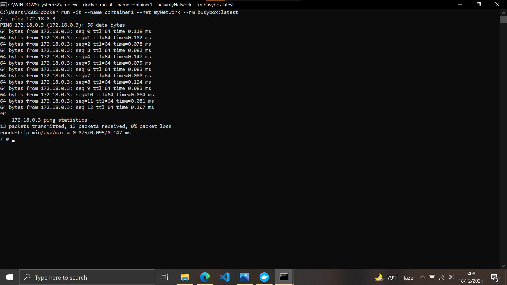

# 11 - Docker Bagian 02

## Tujuan Pembelajaran

1. Mahasiswa dapat mengetahui secara jelas network di Docker
2. Mahasiswa mengetahui konsep volume pada Docker
3. Mahasiswa mampu memanfaatkan dan menggunakan volume ataupun network ketika build image docker.
4. Mahasiswa bisa menggunakan docker compose dalam pembuatan aplikasi.

## Hasil Praktikum

### Membuat dan memeriksa docker network
Berikut ini adalah hasil dari langkah-langkah praktikum :

1. Pertama ketik perintah di bawah ini untuk mengetahui network yang tersedia pada docker host kita

    

2. Selanjutnya untuk mengetahui perintah-perintah dasar yang bisa digunakan untuk docker network

    

3. Untuk membuat network bisa menggunakan perintah create seperti pada gambar di bawah ini :

    

4. Selanjutnya cek network yang sudah dibuat menggunkan perintah ls, seharusnya akan menambahkan network. Hasilnya adalah sebagai berikut :

    

5. Terakhir, ketika ingin mengetahui informasi detail dari network yang telah kita buat bisa menggunakan perintah inspect :

    

### Menghubungkan Container ke Network
Berikut ini adalah hasil dari langkah-langkah praktikum :

6. Buat terlebih dahulu contoh container, misalkan kita akan membuat container linux yaitu busybox.

    

7. Buat container yang kedua menggunakan image linux alphine, buka windows yang baru agar container1 tetap berjalan
 
    
    Jangan lupa mengubah nama container dari yang sebelumnya.

8. Kemudian cek masing-masing container tersebut menggunakan perintah ps untuk mengetahui status container yang sedang jalan. Buka windows baru, jalankan perintah berikut :

    

9. Kemudian jalankan inspect untuk mengetahui informasi detail dari masing-masing container.

    
    
    

10. Untuk membuktikan silakan ping dari container1 ke container2, seharusnya akan reply.
    
    

### Membuka Port Container

Berikut ini adalah hasil dari langkah-langkah praktikum :

1. Misalkan kita ingin membuat image dari apache, layanan httpd. Bisa dilakukan dengan perintah di bawah ini 

    

2. Silakan cek menggunakan telnet terhadap port yang di-expose, seharusnya akan menghasilkan output seperti berikut :

    

3. Kemudian untuk mengetahui port yang dilakukan expose pada container, bisa menggunakan perintah di bawah ini :

    

