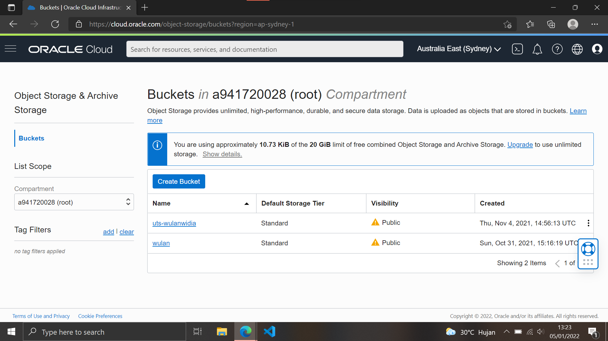
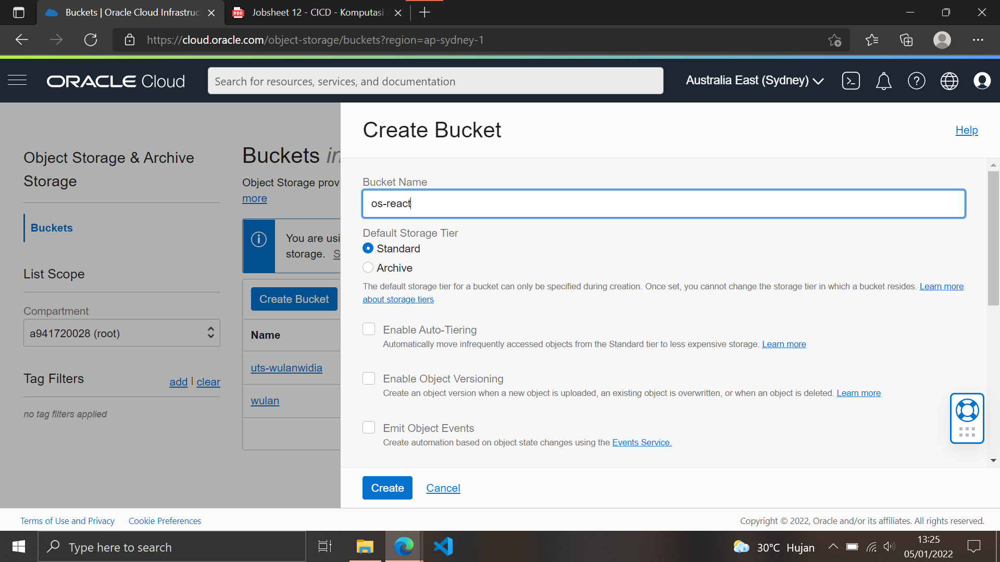
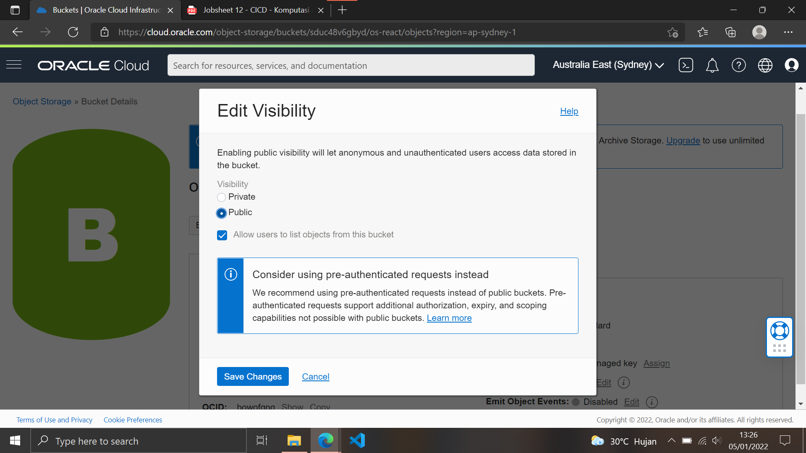
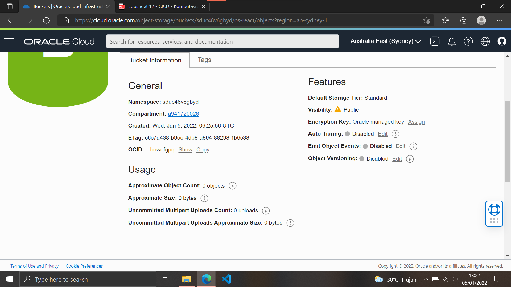
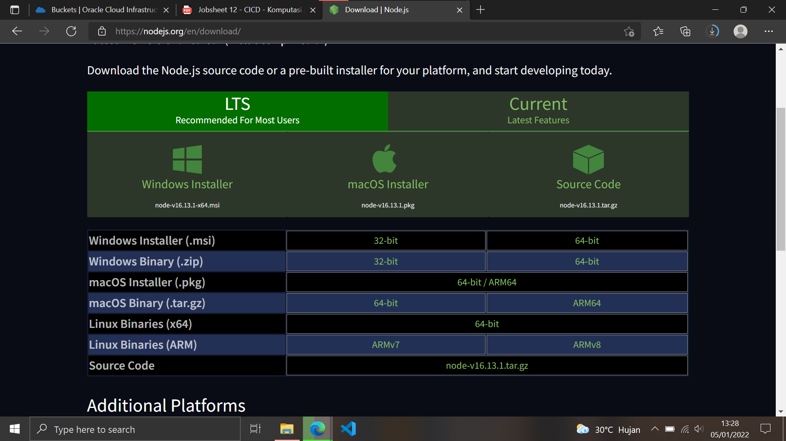
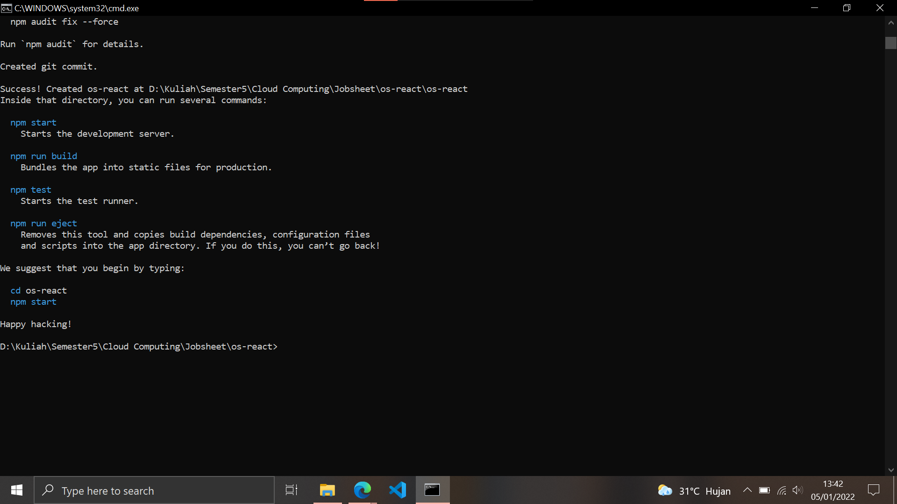
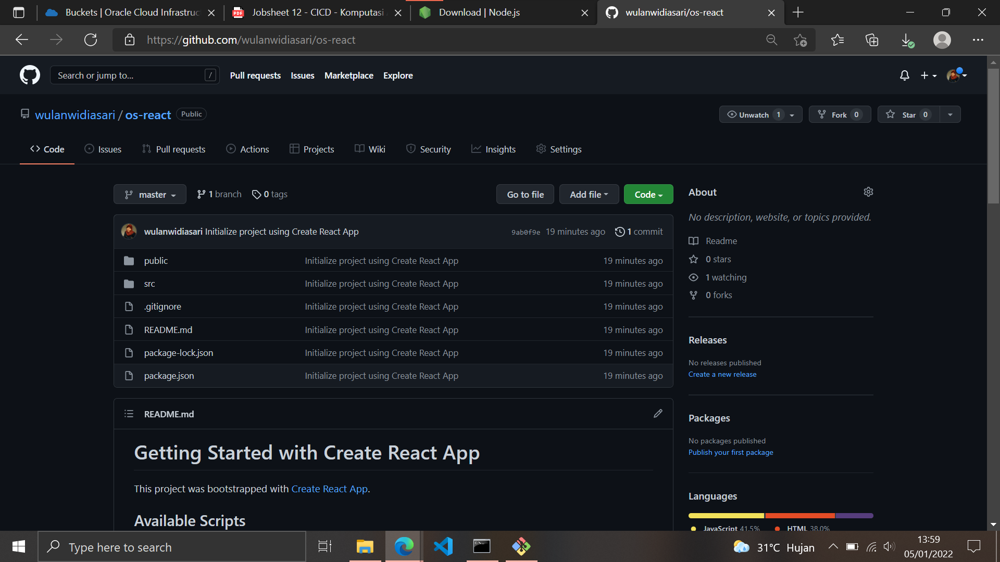

# 12 - CICD

## Tujuan Pembelajaran

1. Dapat melakukan hosting static website menggunakan CI/CD Pipeline.

## Hasil Praktikum

### Praktikum 1 - Mempersiapkan Bucket Object Storage
Berikut ini adalah hasil dari langkah-langkah praktikum :

1. Masuk ke akun https://cloud.oracle.com dan navigasi ke menu Storage -> Buckets.

    

2. Tekan tombol Create Bucket, dan lengkapi Bucket Name dengan os-react. Biarkan nilai lainnya dengan nilai default kemudian tekan tombol Create.

    

3. Ubah visibility bucket dengan menekan tombol Edit Visibility, dan ubah menjadi public. Tekan tombol Save Changes untuk menyimpan perubahan.

    

4. Pada dashboard bucket, perhatikan nilai Namespace. Nilai ini nanti akan digunakan untuk pengaturan deployment.

    

### Praktikum 2 - Menyiapkan Project

Berikut ini adalah hasil dari langkah-langkah praktikum :

1. Pada praktikum ini, akan digunakan React sehingga harus diinstall terlebih dahulu Node. Untuk langkah instalasi Node silahkan gunakan tautan berikut sebagai referensi https://nodejs.org/en/download/ atau https://nodejs.org/en/download/package-manager/

    

2. Setelah Node terinstall, silahkan lakukan Langkah generate project dengan menggunakan perintah berikut :

    

3. Buatlah repository pada GitHub kemudian push project tersebut ke dalam repository.
 
    
  
