# 13 - Serverless

## Tujuan Pembelajaran

1. Mahasiswa dapat mengetahui secara jelas Mengenai Serverless.

## Hasil Praktikum

Berikut ini adalah hasil dari langkah-langkah praktikum :

1. Masuk ke akun https://cloud.oracle.com dan navigasi ke menu Developer Services -> Applications.

    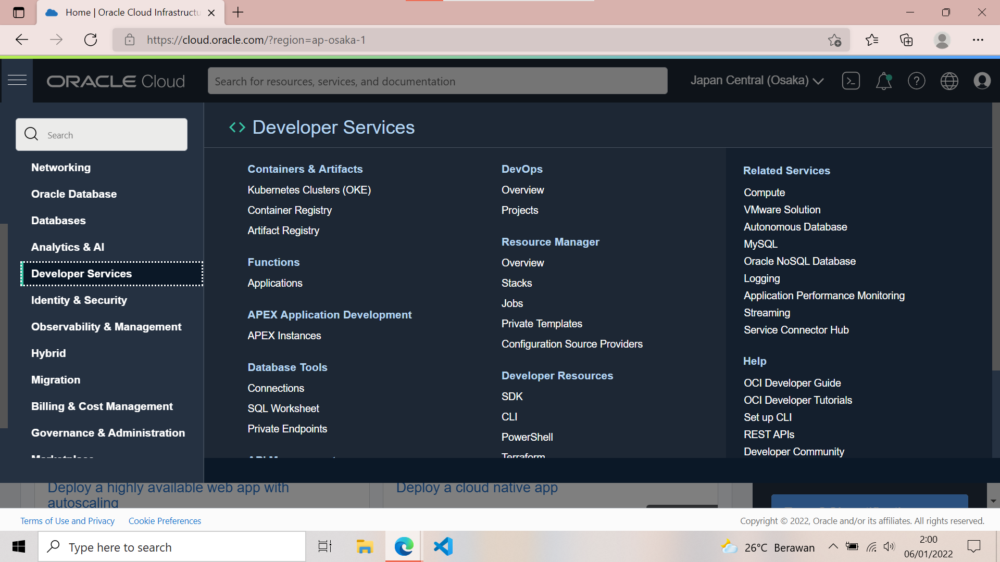

2. Tekan tombol Create Application dan lengkapi informasi form Name dengan hello-app. Lengkapi juga VCN dan subnet yang dibutuhkan. Jika anda belum mempunyai VCN, silahkan membuat terlebih dahulu VCN.

    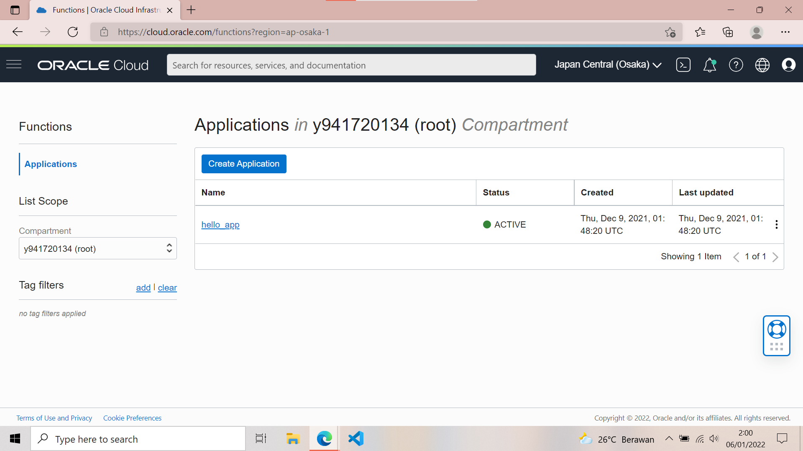

3. Tekan tombol create dan tunggu sampai muncul halaman Getting Started.

    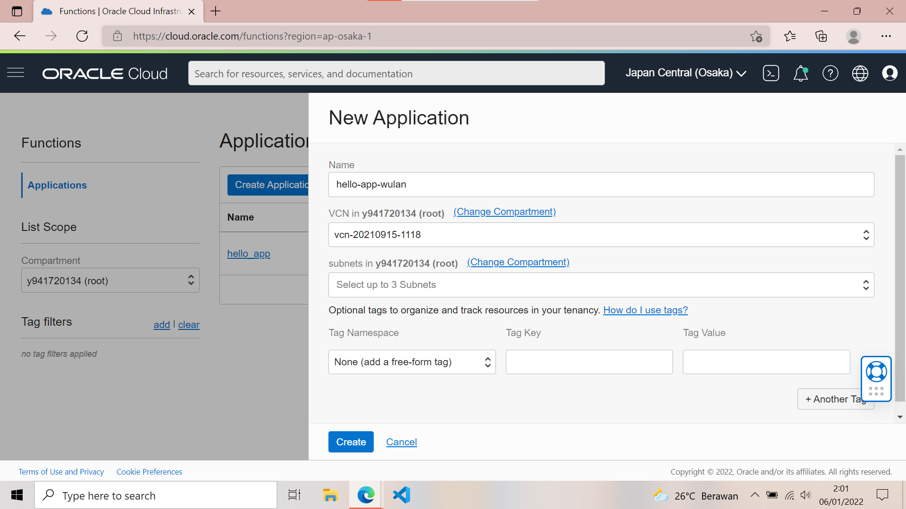

4. Pada halaman Getting Started terdapat contoh langkah-langkah deploy menggunakan perintah fn. Terdapat dua pilihan deploy, melalui Cloud Shell Setup atau Local Setup.

    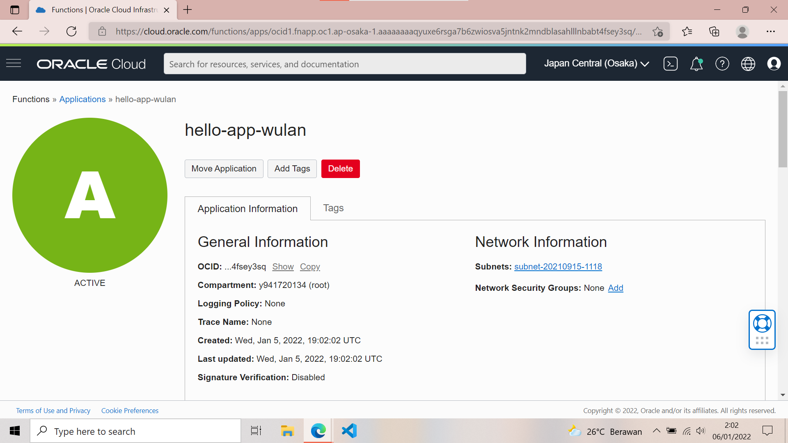

5. Aktifkan Cloud Shell dengan menekan tombol Launch Cloud Shell. Tunggu proses provisioning cloud shell selesai. Anda akan mendapatkan sebuah terminal built-in yang dapat digunakan untuk melakukan proses deployment.

    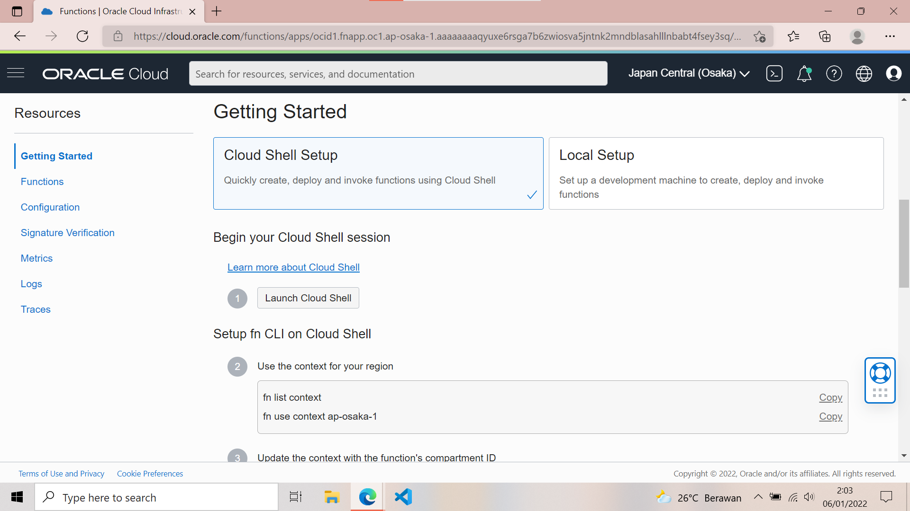

6. Ikuti langkah-langkah dengan melakukan copy perintah kemudian tempelkan ke dalam terminal Cloud Shell.

    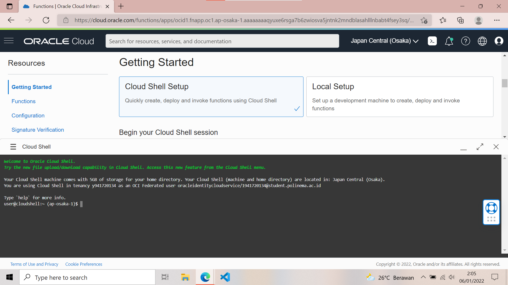

7. Tampilkan context region
 
    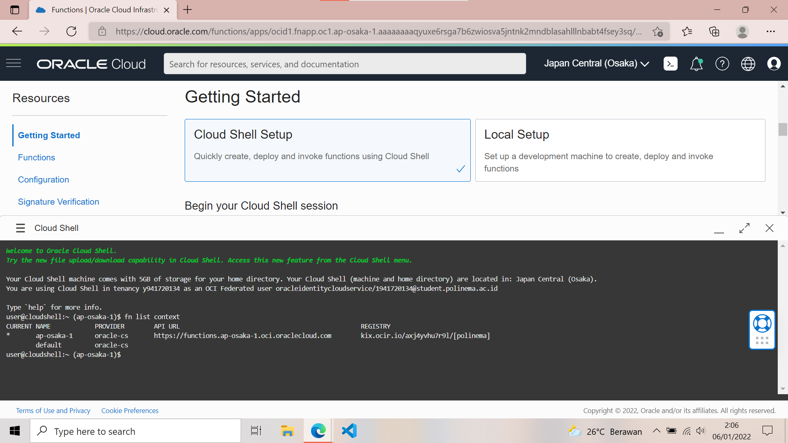

    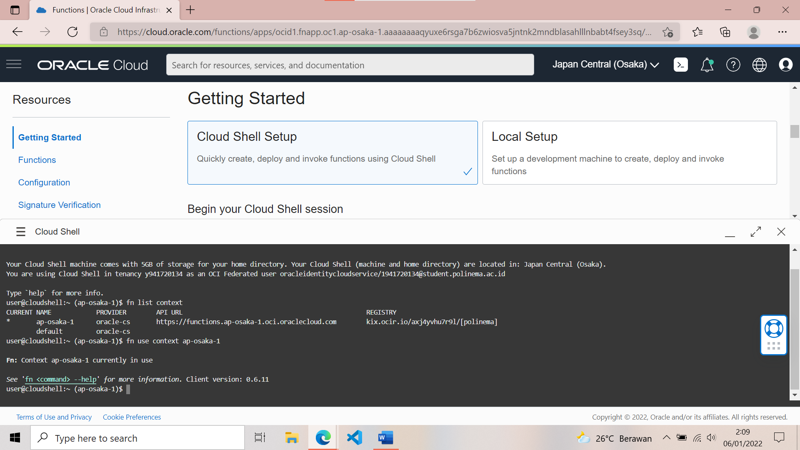

8. Lakukan update context oracle

    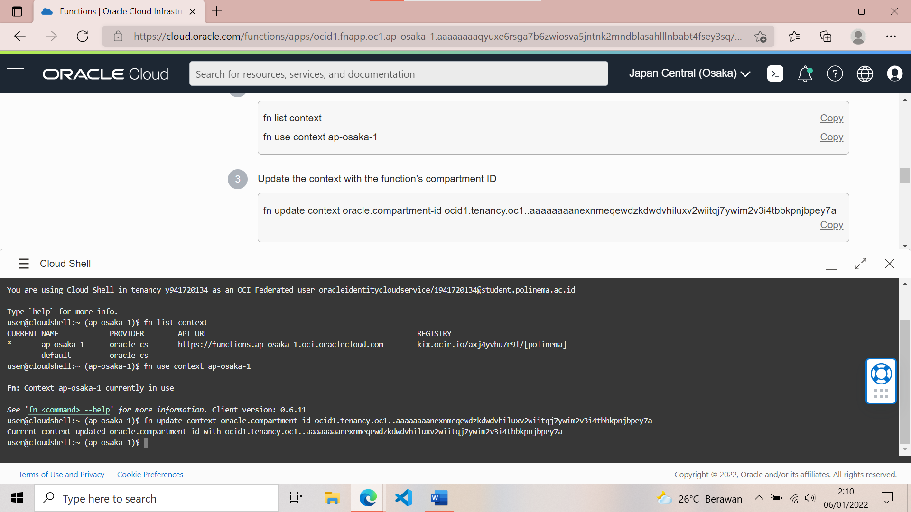

9. Lakukan update context registry

    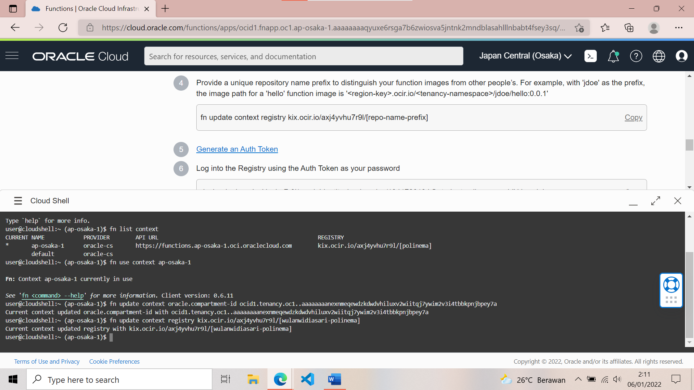

10. Generate token

    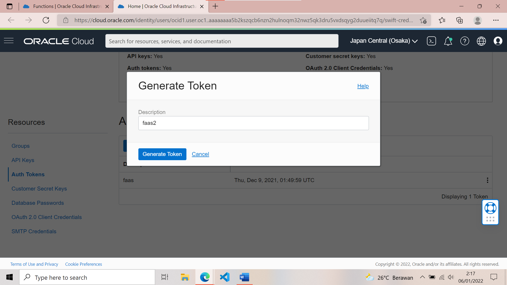

    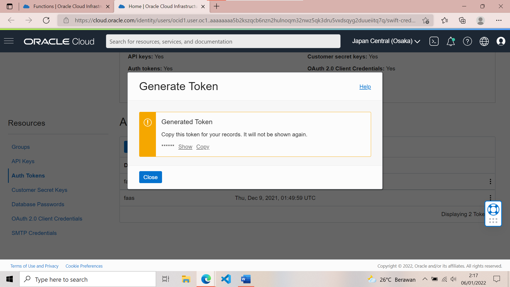

11. Login docker

    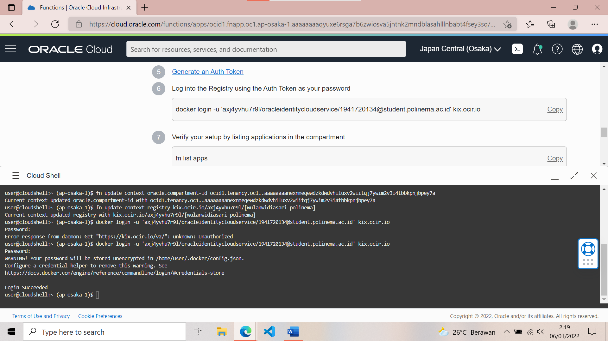

12. Tampilkan list apps

    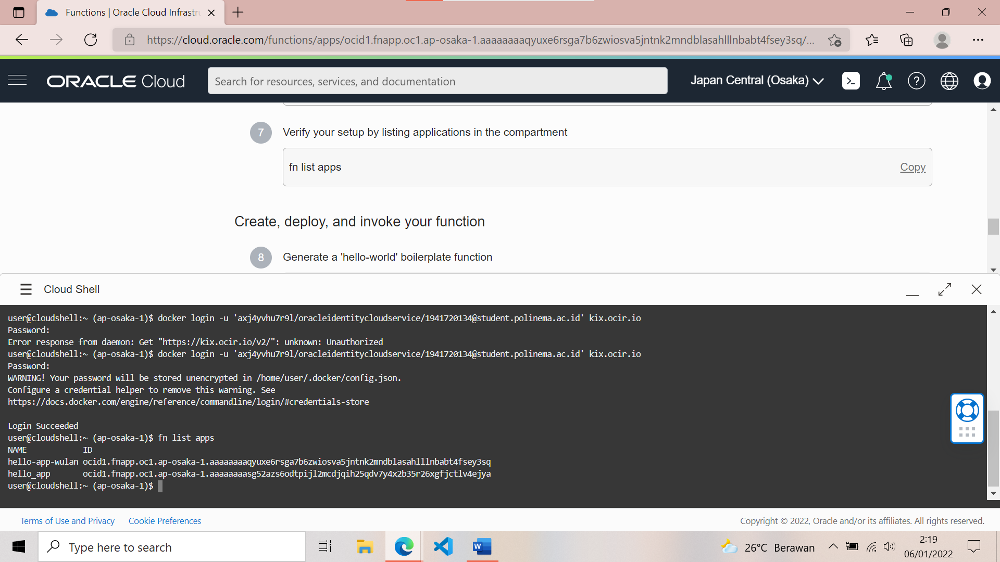

13. Generate Hello-World

    

14. Switch Into the generated directory

    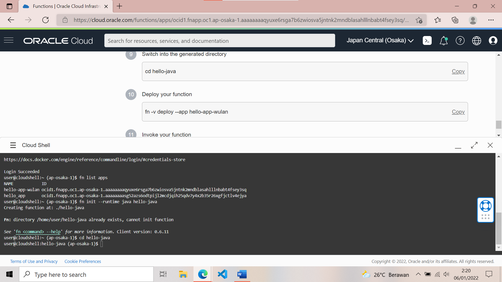

15. Deploy your function

    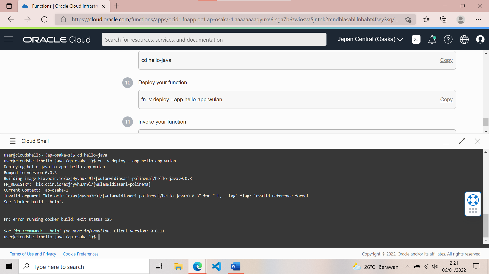

16. Invoke your function

    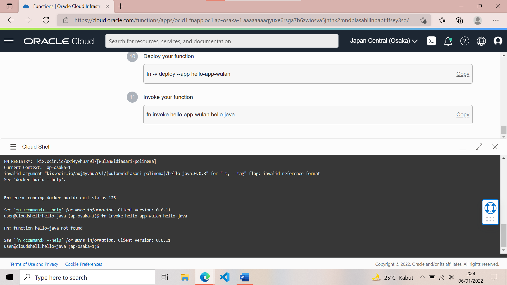