# 15 - AutoScalling

## Tujuan Pembelajaran

1. Mahasiswa dapat mengetahui Infrasturktur Autoscalling pada Oracle

## Hasil Praktikum

### Praktikum 1 - Membuat Konfigurasi Instance

Berikut ini adalah hasil dari langkah-langkah praktikum :

1. Pada halaman detail instance, klik menu More Actions dan pilih Create Instance Configuration.

    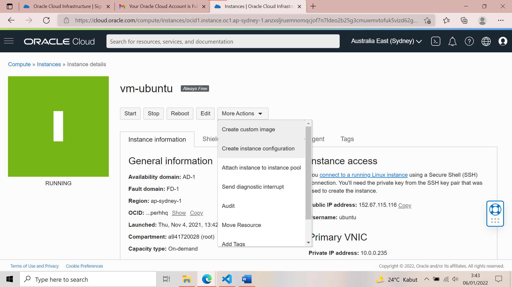

2. Pilih kompartemen Anda. Untuk nama, masukkan instance-config.

    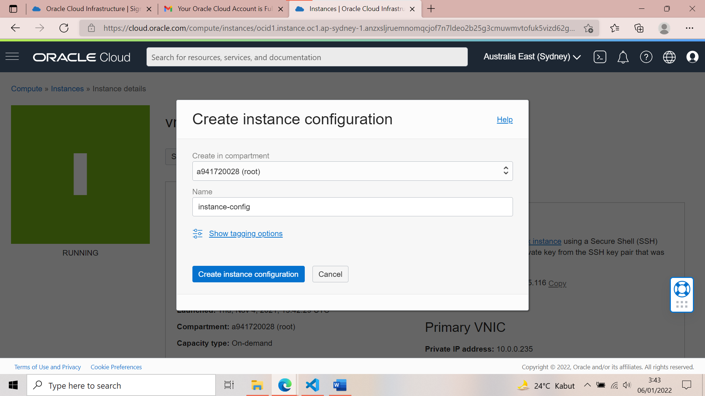

3. Click Create Instance Configuration. Setelah Anda membuat konfigurasi instance, halaman detailnya akan ditampilkan, seperti yang ditunjukkan pada gambar berikut.

    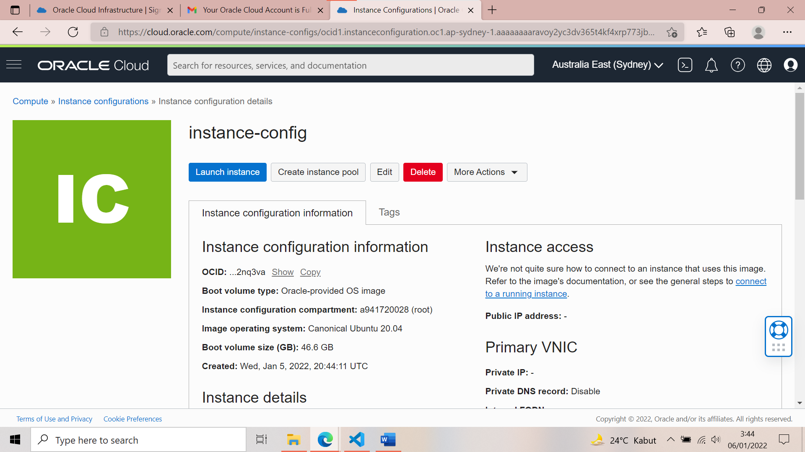

### Praktikum 2- Membuat Instance Pool

Berikut ini adalah hasil dari langkah-langkah praktikum :

1. Klik Create Instance pool. Dari daftar Kompartemen, pilih kompartemen tempat Anda membuat konfigurasi instans. Untuk nama, masukkan my-instance-pool. Dari daftar Konfigurasi Instance, pilih instance-config.

    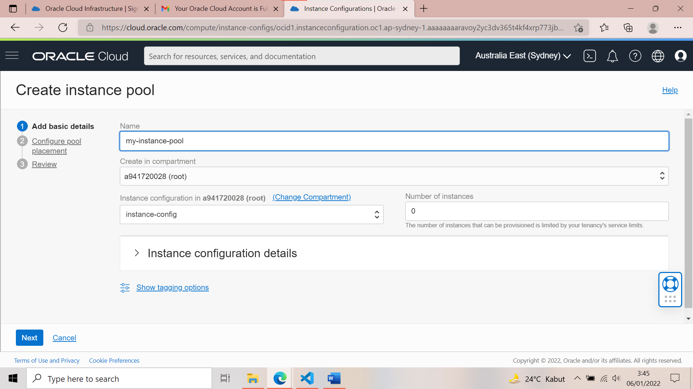

2. Untuk melanjutkan, pilih AD1 untuk availability domain, VCN dan subnet. Klik Next dan kemudian Create untuk membuat kolam instans.

    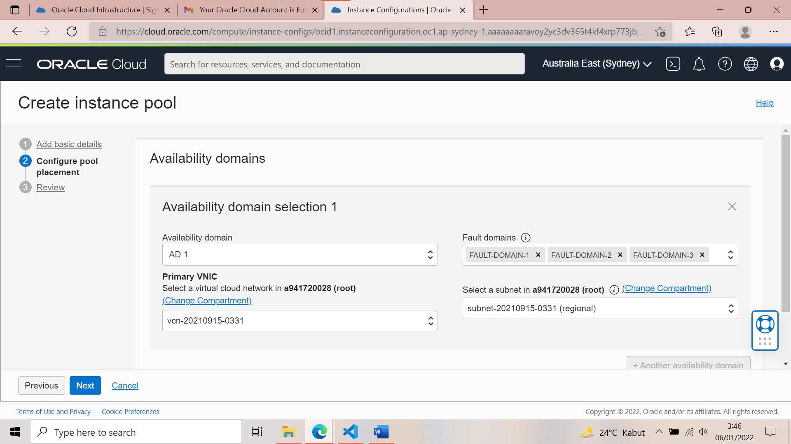

3. Next untuk review.
 
    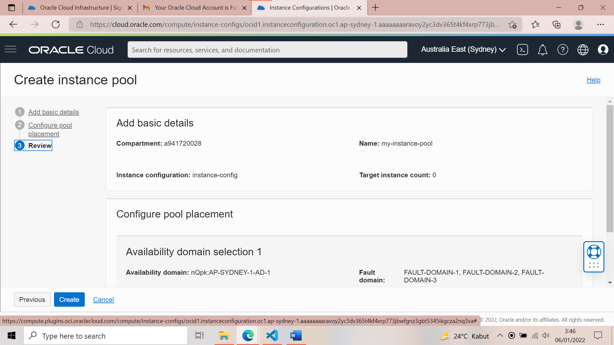

4. Pembuatan Instance Pool telah selesai.

    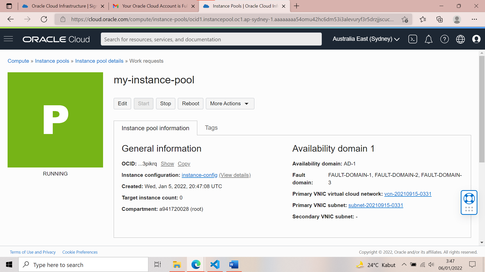

### Praktikum 3- Membuat Konfigurasi Autoscalling 

Skenarionya adalah barangkali suatu saat instans yang ada tidak dapat menangani kebutuhan komputasi. Maka dibuat konfigurasi penskalaan otomatis yang secara otomatis menskalakan jumlah instans di kolam instance. Kita akan buat konfigurasi penskalaan otomatis dari halaman detail instance pool. Berikut ini adalah hasil dari langkah-langkah praktikum :

1. Klik menu More Actions dan pilih Create Autoscaling Configuration.

    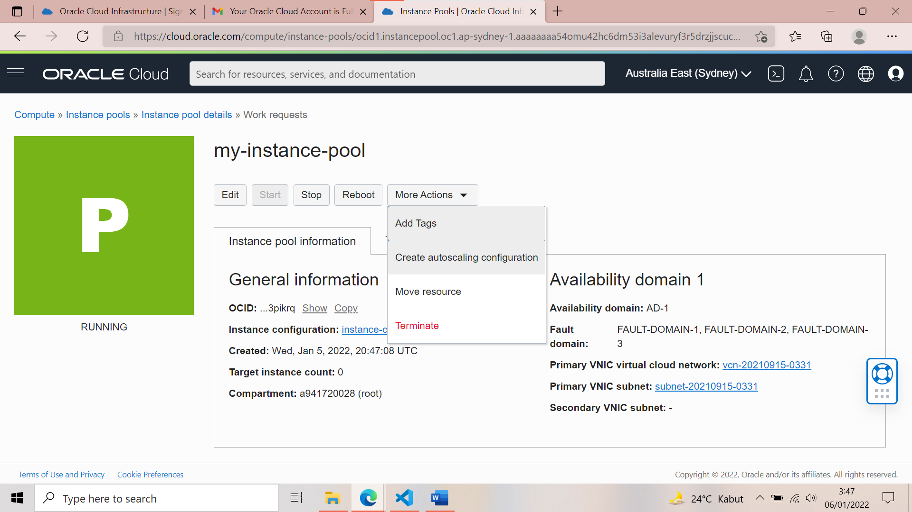

2. Untuk nama, masukkan my-autoscaling-config. Dari daftar Buat di kompartemen, pilih kompartemen tempat Anda membuat kumpulan instans.

    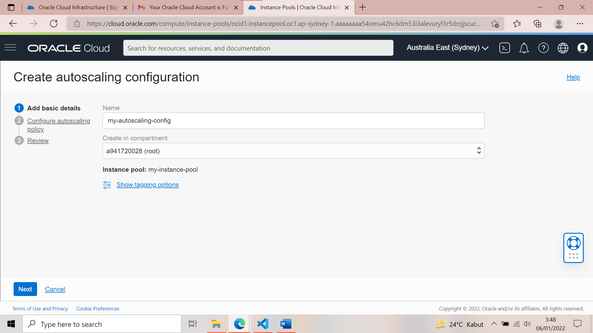

3. Mengisi Konfigurasi yang sesuai.

    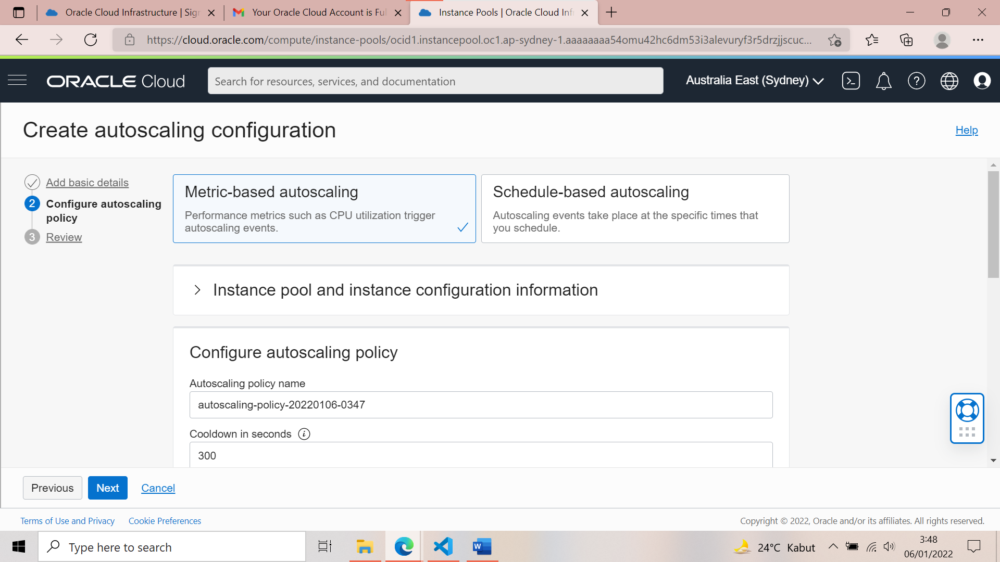
    
    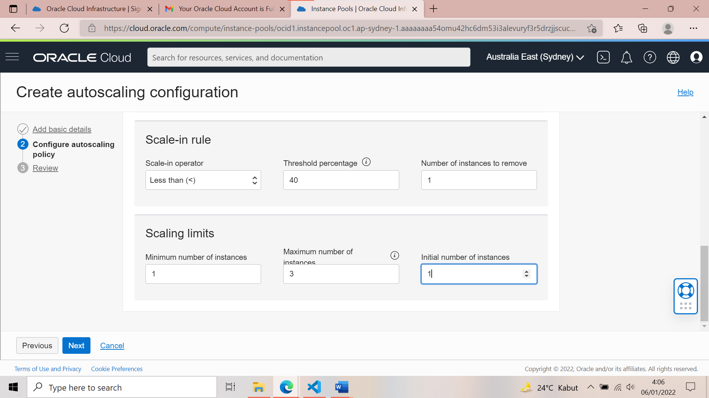

4. Setelah Anda mengonfigurasi Autoscalling policy, klik Create. Anda dapat menentukan beberapa konfigurasi penskalaan otomatis untuk kumpulan instance yang sama, dan Anda dapat mengaktifkan atau menonaktifkannya salah satunya.

    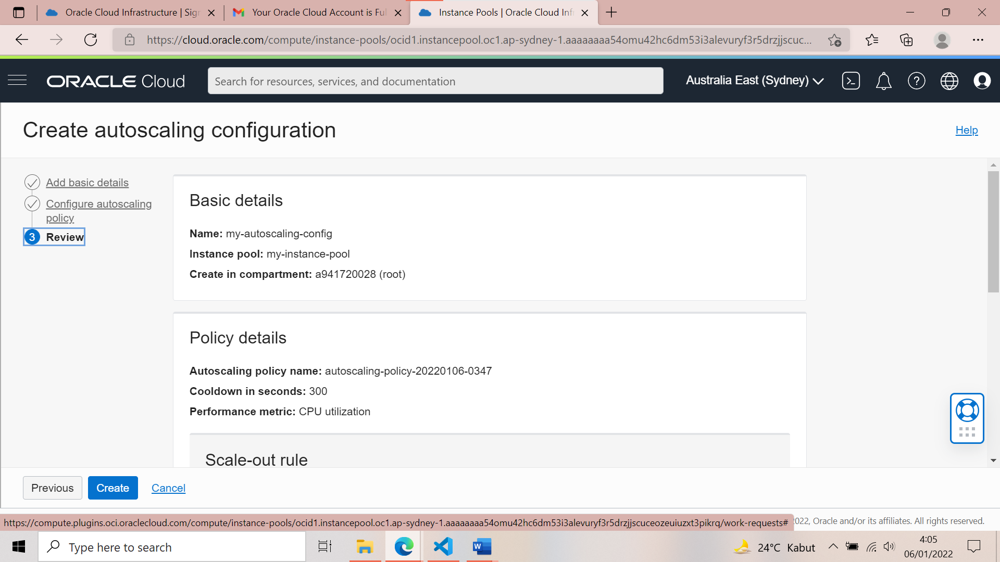

5. Membuat konfigurasi autoscalling telah selesai.

    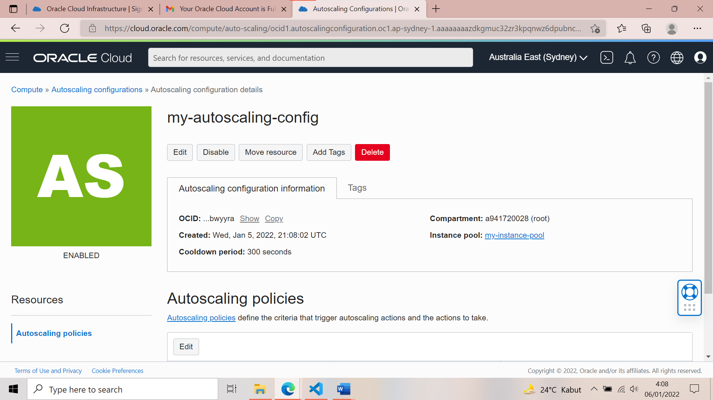

### TUGAS AUTOSCALLING

Jelaskan keterkaitan autoscalling dengan availability!

**Jawaban** : Autoscalling berfungsi untuk menyesuaikan kebutuhan komputasi agar biaya lebih hemat. Karena Autoscalling dapat menghandle variasi kebutuhan komputasi dengan menyediakan infrastruktur komputasi yang cukup untuk menghandle beban saat trafik sedang tinggi-tingginya. Availability berfungsi untuk menyeimbangkan antar zona secara otomatis agar seimbang.