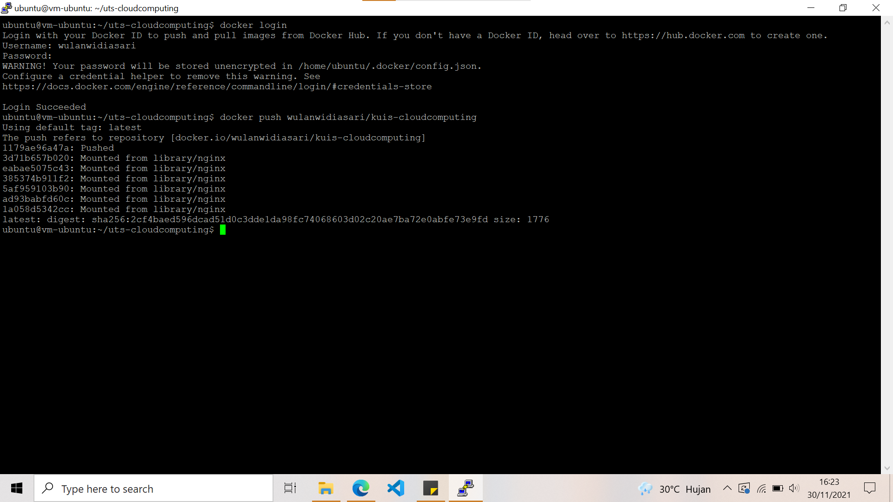

# KUIS BAGIAN 02

## Langkah Praktikum

### Install Docker dan Membuat Kontainer
Berikut ini adalah hasil dari langkah-langkah praktikum :

1. Silakan masuk ke virtual mesin Anda kemudian jalankan perintah di bawah ini
    
    

    Tunggu beberapa saat sampai proses update selesai, jika ada dialog yang menginfokan untuk dilakukan upgrade silakan dijawab dengan ‘y’

2. Install paket yang dibutuhkan sebelum melakukan installasi docker, jalankan perintah di bawah ini :
    

3. Langkah selanjutnya yaitu menambahkan repository docker, dengan beberapa baris perintah di bawah ini :
    
    
    
    
    
    Step ini merupakan step langkah dipraktikum. Dimana outputnya menjelaskan bahwa rangkaian tersebut telah terinstall.

4. Intallasi docker :

    

    Ketika progress installasi sudah selesai, kemudian cek apakah docker daemon sudah jalan menggunakan perintah systemctl.

    

    Jika menampilkan status active (running), berarti docker daemon sudah berjalan. Untuk  jelasnya perhatikan output di bawah ini

5. Untuk memastikan kembali, kita butuh menggunakan image test apakah docker benar-benar berjalan sebagaimana semestinya. Gunakan perintah :

    

6. Jika kita perhatikan perintah-perintah di atas, untuk menjalankan docker harus menggunakan sudo, sedangkan terkadang semua pengguna memiliki image masing-masing. Untuk menjalankan perintah docker tanpa menggunakan sudo, berikut ini perintahnya :

    

7. Ketika kita mengembangkan aplikasi web tentunya membutuhkan sebuah web server, hal yang dilakukan dengan melakukan installasi paket tersebut diikuti dengan Langkah-langkah yang lain. Dengan docker, kita cukup satu baris perintah apache sudah bisa berjalan. 

    

### Login akun docker Hub

Berikut ini adalah hasil dari langkah-langkah praktikum :

1. Login pada Docker 

2. Kemudian Anda bisa melihat repository yang telah Anda buat sebelumnya, jika telah membuat. Sebagai contoh seperti berikut.

    

## Build Image

Berikut ini adalah hasil dari langkah-langkah praktikum :

1. Masuk ke direktori uts-cloudcomputing yaitu file pada uts sebelumnya. Lalu buat dockerfile pada direktori tersebut menggunakan **sudo nano Dockerfile** :

    

2. Setelah itu kita dapat membuild seperti pada lampiran dibawah ini.

    

3. Jika kita ingin upload ke docker hub maka login terlebih dulu. Selanjutnya upload image yang telah kita buat menggunakan perintah di bawah ini:

    

5. Cek pada repositories docker hub. Apabila berhasil maka tampilannya seperti gambar dibawah :

    

Kuis 02 telah selesai, terimakasih banyak.