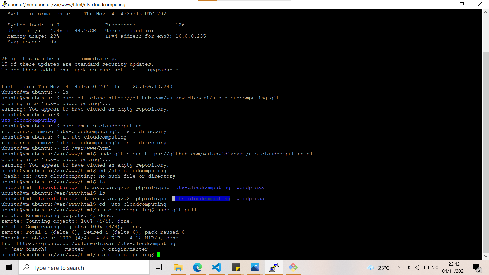

# Ujian Tengah Semester

Berikut adalah langkah-langkahnya :

1. Login instance/virtual machine melalui putty

    

2. Membuat repositori pada github

    

3. Membuat database 

    

4. Git clone repositori github untuk menyimpan data github

    

5. Buka menu storage -> bucket pada oracle

    

6. Create Bucket dan isi nama Bucket

    

7. Buka bucket yang sudah dibuat tadi. Lalu edit visibilitynya menjadi public 

    

8. Scroll down lalu pada bagian object pilih upload. 

    

9. Pilih file yang akan diupload, disini saya menggunakan index.html dan style.css

    

10. Pada bagian index.html buka link pada detail. Berikut adalah tampilannya 

    

11. Upload file tersebut melalui git bash ke git repository

    

12. Git pull agar file pada repo masuk kedalam folder pada var/www/html/uts-cloudcomputing

    

13. Jika file sudah masuk kedalam instance maka dapat dimuat melalui ip public

    

## Ujian Tengah Semester Telah Selsai
 Mohon maaf atas keterlambatan pengumpulan uts saya dikarenakan instance saya baru bisa, pak. terimakasih banyak.

